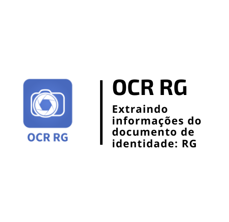

<h1 align="center">
    
</h1>

<h4 align="center"> 
	🚧 OCR RG 1.0 🚀 em desenvolvimento... 🚧
</h4>

<p align="center">
  

  

  	
  <a href="https://www.linkedin.com/in/emerson-rafael/">
    
  </a>
	
  
  <a href="https://github.com/emersonrafaels/ocr_rg/commits/main">
    
  </a>

  
   <a href="https://github.com/emersonrafaels/ocr_rg/stargazers">
    
  </a>
</p>


## 💻 Sobre o projeto

📦 **OCR RG** é um projeto que permite **realizar leitura dos campos do documento de identidade RG**

Atualmente funcionando para:

 1. Registro Geral (RG)
 2. Data de expedição
 3. Nome
 4. Nome do pai
 5. Nome da mãe
 6. Data de nascimento
 7. Cidade de nascimento
 8. Estado de nascimento
 9. Cidade de origem
 10. Estado de origem 
 11. Orgão emissor (Em desenvolvimento)

## 🛠  Tecnologias

As seguintes ferramentas foram usadas na construção do projeto:

- [Python]

## ♤♠♧♣  Modelos

 - **Modelo 1** - Detecção de campos utilizando HOG e SVM (Em desenvolvimento)
 - **Modelo 2** - Aplicação de uma máscara de acordo com o template do OCR, obtendo os campos de acordo com as coordenadas pré definidas.
 - **Modelo 3** - Aplicação do OCR no documento inteiro.
 - **Modelo 4** - Aplicação da técnica de bounding box recursivo, identificando locais que possuem texto e realizando o OCR em seguida.

## 🚀 Como executar o projeto

1. **Instalando**: pip install -r requirements.txt
2. **Seguir modelos apresentados no diretório de testes**:

Ex: Executando o **modelo 3: OCR no documento inteiro**:

```python
from MODELS.main_model_three import main_model
def orchestra_test(input_dir, output_dir, dir_db_results):

    # CRIANDO O DIRETÓRIO QUE RECEBERÁ AS IMAGENS PROCESSADAS
    validador = create_path(output_dir)

    if validador:

        # OBTENDO TODAS AS IMAGENS DA PASTA
        lista_imagens = get_files_directory(input_dir, [".png", "jpg"])

        # PERCORRENDO TODAS AS IMAGENS PARA OCR
        for image in lista_imagens:

              print("IMAGEM ATUAL: {}".format(image))
              dt_hr_inicio = get_date_time_now("%d/%m/%Y %H:%M:%S")

              result_image = main_model(image)

              dt_hr_fim = get_date_time_now("%d/%m/%Y %H:%M:%S")

              _ = insert_processed_image(dir_bd_results, image, result_image,
                                         dt_hr_inicio, dt_hr_fim)

input_dir = r'C:\Users\Emerson\Desktop\brainIAcs\MASSA_IMAGENS\RG\Jose_Clerton.png'
output_dir = r'RESULTADOS/MODEL_THREE'
dir_bd_results = r'DB_RG_OCR_TESTS.db'

# CHAMANDO O ORQUESTRADOR DE TESTES
orchestra_test(input_dir, output_dir, dir_bd_results)
```
Os **arquivos de teste mostram como realizar a chamada dos modelos**, ao mesmo tempo que **implementam um fluxo completo para realização de testes e inserção dos resultados em um banco de dados**.

## ➊ Pré-requisitos

Antes de começar, você vai precisar ter instalado em sua máquina as seguintes ferramentas (O download pode ser realizado pela própria página do Python ou Anaconda):
[Python](https://www.anaconda.com/products/individual).

## [≝] Testes
Os testes estão na pasta: **TESTS/***.
Nela é possível verificar os testes disponíveis em arquivos individuais para cada um dos modelos de OCR de RG disponíveis.

## 📝 Licença

Este projeto está sob a licença MIT.

Feito com ❤️ por **Emerson Rafael** 👋🏽 [Entre em contato!](https://www.linkedin.com/in/emerson-rafael/)

[Python]: https://www.python.org/downloads/